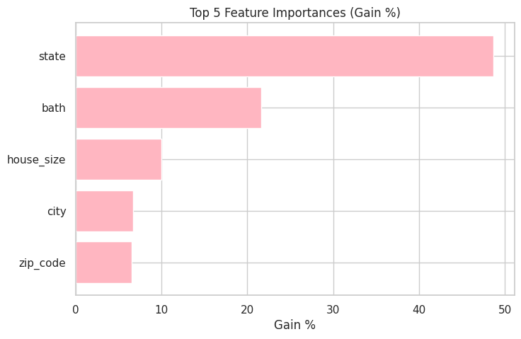

# 🏡 USA Real Estate — House Price Prediction

## 📌 Project Overview
This project analyzes and predicts **house prices across the United States** using structured property and location data.  
The study includes:
- **Extensive data cleaning**
- **Exploratory Data Analysis (EDA)**
- **Hypothesis testing**
- **Feature engineering**
- **Machine learning model building and evaluation**

The primary focus is to understand what drives housing prices and to build a predictive model that balances performance with interpretability while avoiding data leakage.

---

## 📂 Data
- **Source**: *Kaggle: https://www.kaggle.com/datasets/ahmedshahriarsakib/usa-real-estate-dataset*  
- **Size**: ~ over 2 million records  
- **Key variables**:  
  - Property characteristics (bedrooms, bathrooms, area, house size, etc.)  
  - Location features (state, city, zip code)  
  - Listing details (status, price)  

---

## 🔍 Methodology

### 1. Data Cleaning
- Removed duplicates and irrelevant columns  
- Handled missing values:  
  - Numeric → imputed with mean  
  - Categorical → filled with "Unknown"  
    
- Standardized column naming and datatypes
- Clean Dataset Size: 992,522 records

---

### 2. Exploratory Data Analysis (EDA)
- Distribution of prices and log-prices

- Relationships between bedrooms, bathrooms and price

- Boxplots of price across states/cities

- Correlation heatmaps 

---

### 4. Feature Engineering
**Engineered features (not in original dataset):**
- `bed_bath_ratio` → ratio of bedrooms to bathrooms  
- `lots_house_ratio` → lot area vs. house area ratio  
- `price_per_sqft` *(dropped later to prevent leakage)*  
- `house_cat` → price bins *(dropped later to prevent leakage)*  

---

### 5. Model Building
- **Baseline Models**: Median predictor, Linear Regression  
- **Main Model**: XGBoost Regressor  
  1. Trained with encoded variables
  2. Trained with Categorical variables passed as **native categories** (no one-hot encoding)  
- **Evaluation metrics**: RMSE, R²  

---

## ⚙️ Features

**Numeric**
- `bed`, `bath`, `total_area`, `house_size`  
- `bed_bath_ratio`, `lots_house_ratio`  

**Categorical**
- `status`, `state`, `city`, `zip_code`  

**Dropped (to avoid leakage)**
- `house_cat` (bins of price)  
- `price_per_sqft` (directly derived from price)  

---

## 📊 Results

### Model Performance
| Model                    | RMSE ($)   | R²    |
|--------------------------|------------|-------|
| Baseline (Median)        | ~218,000   |   -   |
| Linear Model (w leakage) | ~64,000    | 0.91  |
| XGBoost (w leakage)      | ~7,700     | 0.99  |  
| XGBoost (final model)    | ~93,000    | 0.81  |

---

### Top Feature Importances (XGBoost, Gain %)
1. **State (~49%)**  
2. **Bathrooms (~22%)**  
3. **House size (~10%)**  
4. **City (~7%)**  
5. **Zip code (~7%)**  

**Interpretation:**  
Geographic indicators (state, city, zip code) provide the **strongest signal** for predicting house prices, reflecting regional price variation. Among property characteristics, **bathrooms and house size** play the next most important roles in determining price.

---

## 👤 Author
**Name**: Arun Chand
Data Scientist | MBA
**Contact**: chandarun12@gmail.com
---
